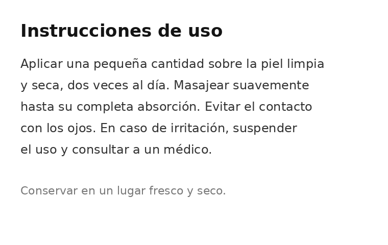
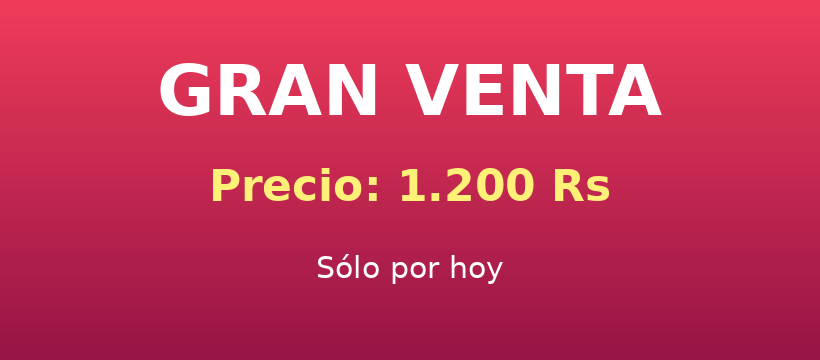

# Image Text Translation Pipeline

A FastAPI service that detects text in an image, translates it to English, and returns a reconstructed image with the translated text rendered in place of the original — preserving layout, font size, and text color.

---

## Before & After

### Image 1 — Oferta Especial (Special Offer)
| Before | After |
|:---:|:---:|
|  |  |

### Image 3 — Instrucciones (Instructions)
| Before | After |
|:---:|:---:|
|  |  |

### Image 6 — Gran Venta (Great Sale)
| Before | After |
|:---:|:---:|
|  |  |

---

## How to Run Locally

**Prerequisites:** Python 3.10+, a virtual environment with dependencies installed.

```bash
# Install dependencies
pip install -r requirements.txt

# Add your Gemini API key
echo "GEMINI_API_KEY=your_key_here" > .env

# Start the server
uvicorn main:app --reload
```

API docs available at: `http://127.0.0.1:8000/docs`

---

## Running with Docker

```bash
# Build the image
docker build -t image-translation-pipeline .

# Run — recommended: pass .env at runtime so the key is never baked into the image
docker run --env-file .env -p 8000:8000 image-translation-pipeline
```

Alternative ways to inject `GEMINI_API_KEY`:

```bash
# Mount .env as a volume
docker run -v $(pwd)/.env:/app/.env -p 8000:8000 image-translation-pipeline

# Pass the key directly (one-off)
docker run -e GEMINI_API_KEY=your_key_here -p 8000:8000 image-translation-pipeline
```

> **Note:** The `images/` folder is copied into the container at build time, so `POST /batch-process` works out of the box. Reconstructed images are written to `/app/reconstructed-images/` inside the container — mount a volume if you want them on the host:
> ```bash
> docker run --env-file .env \
>   -v $(pwd)/reconstructed-images:/app/reconstructed-images \
>   -p 8000:8000 image-translation-pipeline
> ```

---


## Example Requests

### Single image (returns reconstructed PNG)
```bash
curl -X POST http://localhost:8000/process-image \
  -F "image=@images/poster.png;type=image/png" \
  --output result.png
```

### Batch processing (reads from `images/`, saves to `reconstructed-images/`)
```bash
curl -X POST http://localhost:8000/batch-process
```

**Batch response:**
```json
{
  "total": 5,
  "succeeded": 5,
  "failed": 0,
  "output_dir": "reconstructed-images",
  "results": [
    { "file": "poster.png", "status": "success", "output": "reconstructed-images/poster.png" }
  ]
}
```

---

## Pipeline Overview

```
Upload image
    │
    ▼
EasyOCR  ──────────────────────────────────────────────────  detect text chunks + bounding boxes
    │
    ▼
Merge chunks into lines  ──────────────────────────────────  group by vertical overlap → one bbox per line
    │
    ▼
Gemini 2.5 Flash  ─────────────────────────────────────────  translate + self-score confidence (1–10)
    │
    ▼
OpenCV TELEA inpainting  ──────────────────────────────────  erase original text from all chunk boxes
    │
    ▼
K-means color detection  ──────────────────────────────────  find real text color from original crop
    │
    ▼
Pillow text rendering  ────────────────────────────────────  draw translated text, centered or left-aligned
    │
    ▼
Return PNG
```

---

## Key Design Decisions

### EasyOCR for text detection
EasyOCR was chosen because it returns both the recognised text **and** the bounding-box polygon for every detection — exactly what is needed to locate, erase, and re-render text regions. It runs on CPU without any setup overhead, which keeps the service self-contained and deployable anywhere.

### Gemini 2.5 Flash for translation
Gemini 2.5 Flash offers the best cost-to-quality ratio for short structured tasks. Critically, it handles JSON output reliably, which lets us request translations **and** self-evaluated confidence scores (1–10) in a single API call — no second round-trip needed. Being a frontier model it also handles multilingual, noisy OCR text gracefully where smaller models struggle.

### OpenCV for inpainting and image manipulation
OpenCV's TELEA inpainting algorithm is the standard lightweight approach for filling masked regions from surrounding pixel context. It runs in milliseconds on CPU and requires no learned model, making it ideal for a fast inference pipeline.

### Line merging before translation
EasyOCR detects text in small chunks (words or short phrases). Sending each chunk separately to Gemini would fragment sentences, increase cost, and produce inconsistent translations. Merging chunks into whole lines first gives Gemini the full sentence context and reduces API calls by 3–5×.

### K-means (k=2) for text color detection
Instead of a simple black/white brightness heuristic, K-means on the original (pre-inpaint) bounding-box pixels clusters pixels into two groups: background (majority) and text (minority). The minority cluster color is used directly for the rendered translation, preserving white, colored, or gradient text faithfully.

### Paragraph vs. headline alignment detection
Rather than centering all text (which breaks left-aligned paragraphs) or left-aligning all text (which breaks centered headlines), the `is_paragraph_line()` function checks whether a line's `x_min` is within 30 px of any nearby neighbor's `x_min`. A shared left margin → paragraph → left-align. No shared margin → isolated headline → center-align.

### Font size clustering
EasyOCR bounding box heights vary by a few pixels between lines of the same original font size, which would produce inconsistent rendered sizes. All computed font sizes are clustered (±25% tolerance) and snapped to the cluster median, so lines of the same visual level always render at the same size.

---

## Known Limitations

- **Font matching is approximate.** The pipeline uses the closest available system font at the estimated size. Original typeface, weight, kerning, and decorative styles are not preserved.
- **Inpainting quality depends on background complexity.** TELEA works well on solid/gradient backgrounds but can leave artifacts on detailed textures or photographs behind text.
- **EasyOCR chunk merging uses vertical overlap heuristics.** Unusual layouts (rotated text, vertical writing, text on curves) may not merge correctly.
- **CPU-only inference is slow on large images.** EasyOCR on CPU takes 2–8 seconds per image depending on resolution and text density.
- **Confidence scores are self-reported by Gemini.** They reflect the model's internal estimate, not a ground-truth metric, and should be treated as a relative signal.
- **Batch mode reads from a fixed `images/` directory.** No upload support; images must already be on the server filesystem.

---

## What I Would Do Differently With More Time

| Area | Improvement |
|---|---|
| **Font preservation** | Use a font classification model (e.g. DeepFont) to match the original typeface from the crop, not just size |
| **Better inpainting** | Replace TELEA with a diffusion-based inpainter (e.g. LaMa) for complex backgrounds |
| **GPU support** | Add a `gpu=True` flag to the EasyOCR reader and containerise with CUDA for 5–10× speedup |
| **Confidence-gated output** | Optionally skip rendering lines whose `confidence_score < threshold` and leave the original text visible |
| **Language auto-detection** | Pass detected language codes back from EasyOCR (or Gemini) to support non-Latin source scripts reliably |
| **Async pipeline** | Move the CPU-bound OCR and inpainting steps to a background task queue (Celery / ARQ) so the HTTP response returns immediately with a job ID |
| **Output format options** | Allow the caller to request JSON metadata (extracted text, translations, confidence scores, bounding boxes) alongside or instead of the image |
